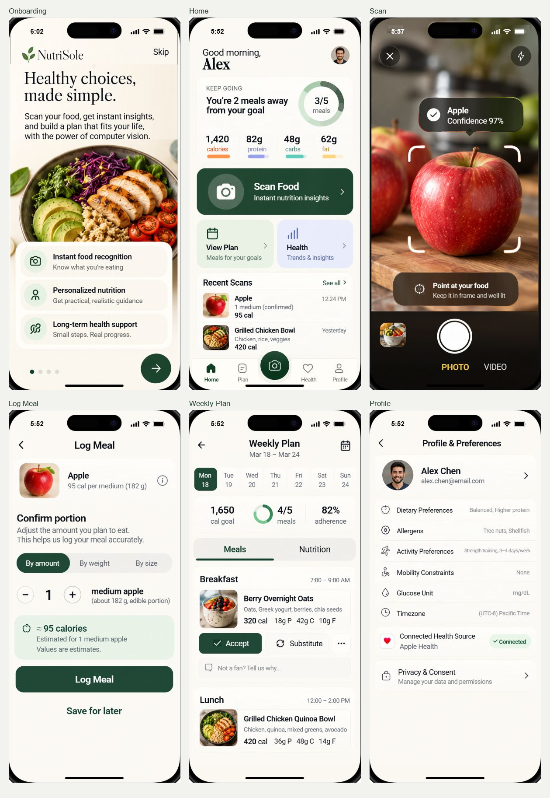

# NutriSole

A frontend prototype for a food and health assistant, built with React, TypeScript, and shared React Native components. NutriSole brings food capture, portion confirmation, meal planning, glucose records, preferences, and support flows into one mobile interface.

[Editable Figma design](https://www.figma.com/design/UQU8ormOKktMlOTzsZaRko) · [Screen coverage](artifacts/screen-coverage/) · [Design QA](design-qa.md)



## Project scope

This repository contains the runnable web frontend, a plain React Native Android/iOS app, individual image/font assets, tests, and the editable Figma importer. Text, forms, navigation, and controls are implemented as components; whole-screen images are used only as reference or QA evidence.

The app is a **frontend demonstration with synthetic data**. Authentication, food recognition, camera capture, health connections, prices, notifications, and staff permissions are simulated. Original demo edits may persist in the current browser; expanded-flow records reset on reload. Deploying the app does not add a backend or synchronize data across users.

## Screens and interactions

The six reference screens remain intact: onboarding, home, scan, log meal, weekly plan, and profile/preferences. Thirty additional concepts and two supporting routes extend the prototype.

| Area | Included views |
| --- | --- |
| Accounts | Sign in, create account, verify email, recover account, reset password |
| Food | Assessment result, market reference, capture retry, food selector, nutrition details, portion confirmation |
| Health | Glucose overview, add reading, reading detail, health connections |
| Planning | Plan generation, activity plan, plan rationale, weekly meal details |
| Foot support | Questionnaire and guidance |
| Personal controls | Assistant, privacy/data rights, reminders |
| Records | Report output, report status, personal history |
| Staff workflows | Catalog queue/review, model release, operations audit, report triage |
| Navigation | Flow directory and screen selector |

Working demo interactions include portion/calorie updates, meal logging and drafts, meal acceptance/substitution, preference editing, manual glucose validation, account form validation, report review, and sample staff evidence gates. The web preview includes iPhone and Pixel device presets, simulated keyboards, and a Reset control.

## Technology

| Layer | Stack |
| --- | --- |
| Web preview | React 19, TypeScript 7, Vite 8, React Native Web |
| Shared app UI | React Native components, semantic scene models, local state |
| Native companion | Plain React Native 0.86.3, React Native CLI, native Android/iOS hosts |
| UI assets | Local food/avatar photos, font files, Lucide/vector icons, source artwork |
| Verification | Node test runner, Playwright, TypeScript, runtime integrity checks |
| Design handoff | Native Figma text, components, shapes, variables, and prototype links |
| Web hosting | Vercel static deployment of `dist/client` |

## Run locally

Use Node.js 24 and npm. Install the web dependencies from the repository root:

```sh
npm ci
npm run dev -- --host 0.0.0.0 --port 4173 --strictPort
```

Open `http://localhost:4173/`. Use the screen selector to explore every view, or open `http://localhost:4173/?screen=flow-directory` for the journey directory. The device picker changes the preview preset; Reset restores the demo fixtures.

Build and preview the production web bundle:

```sh
npm run build
npx vite preview --host 0.0.0.0 --port 4175
```

The web build is written to `dist/client`. The existing build also prepares optional Sites worker files under `dist/server` and `dist/.openai`; Vercel serves only `dist/client`.

### Native app

The plain React Native app in `native/` implements all 38 screens through `native/responsive/`, reusing the shared content, stores, actions and assets from `src/nutrisole/`. It has no Expo dependencies. UI elements, forms, navigation and sheets are live components; food/avatar photographs and small artwork are local assets. Flexbox, measured content space, system-scalable text and native safe areas adapt the layouts to phone sizes. Long content scrolls while navigation and submission footers remain reachable.

Use the five primary destinations: **Home, Plan, Scan, Health and Profile**. Open **Menu & Settings** from Home's header or Profile for history, Assistant, foot support, reminders, account/data preferences, reports and staff previews. All 38 screens are connected by tasks: capture → assessment → correction/nutrition → portion → history; Health → readings/connections; Plan → generation/rationale/activity; and account → verification/sign-in or recovery/reset. Detail pages return to their parent, while changing primary tabs starts that section. The native Home cards keep two columns where their labels fit and stack on compact or enlarged-text layouts. Weekly calendars keep all seven days on one horizontal row, with horizontal scrolling for enlarged text.

```sh
npm --prefix native ci
npm run native:start
npm --prefix native run android
```

Open **`native/android`** directly in Android Studio. Use its bundled JDK and your installed Android SDK. On Windows, prepare the verified project-local Ninja once before building:

```powershell
powershell -ExecutionPolicy Bypass -File native/scripts/prepare-windows-ninja.ps1
cd native/android
./gradlew.bat :app:assembleRelease --max-workers=2 --console=plain
```

The standalone APK is `native/android/app/build/outputs/apk/release/app-release.apk`. It bundles Hermes JavaScript, all screen assets and native font aliases, and runs without Metro or Expo Go. It includes ARM64 phone and x86_64 emulator libraries. NutriSole's leaf launcher icon and cream launch screen replace the starter artwork. This internal evaluation build uses the standard Android development signing key; store distribution requires a private release signing configuration.

The iOS project is `native/ios/NutriSole.xcodeproj`. On macOS, install the Gemfile/CocoaPods dependencies, run `bundle exec pod install` in `native/ios`, then use `npm --prefix native run ios` or open the generated workspace in Xcode. iOS source shares the same screen functionality, but it cannot be compiled or run on Windows.

App links such as `nutrisole://screens/home` and `nutrisole://screens/flow-directory` open validated routes. Unknown or external links are ignored.

The native app no longer shows a screen catalog on Home. Fresh Apple captures lead to the original Log Meal screen; other foods use the matching portion form. Saved portions retain their food, quantity and identity when reopened from History, and confirmed meals update Home. Staff roles are synthetic previews inside the settings workspace. The native runtime preserves transparent layout groups for accurate touch handling; the original six shared source implementations and assets remain unchanged. Gradle tracks shared source and assets outside `native/` so incremental builds include screen edits.

## Verification

```sh
npm run check:runtime
npm run typecheck
npm test
npm run test:expansion
npm run test:sites
npm run build
```

Optional browser and native checks:

```sh
npx playwright install chromium
npm run test:runtime
npm run native:typecheck
npm run native:lint
npm run native:export
```

The expansion baseline protects 119 original screen/shared-asset files. The runtime lock protects 28 device-preview files. The latest Android build, version 1.0.4 (`artifacts/native/NutriSole-Journeys-v1.0.4.apk`), adds task navigation and Menu & Settings. APK binaries are generated locally and are not committed to this source repository. Its Gradle build, 34 native tests, typecheck, lint and preservation checks pass. The installed APK hash matches the delivered file. Physical taps reached 31 screens on an intermediate build before finding and fixing a truncated local JSON preview. The final build installed and opened onboarding without Metro, but emulator system/launcher errors interrupted its full interaction sweep. See [the version 1.0.4 verification record](artifacts/native/navigation-qa/v1.0.4/README.md) for exact evidence and limits; final 38-screen runtime and phone-size verification are incomplete. Verification summaries are versioned; raw logs, screenshots and machine diagnostics remain local.

The previous [version 1.0.3 verification](artifacts/native/responsive-qa/v1.0.3/README.md) records 38 route/catalog checks, 17 interaction groups, 106 phone/text layout checks and three targeted tap/scroll checks. Those results belong to that historical APK and do not certify version 1.0.4. Physical Android and iOS runtime verification remain unperformed. Exact pixel identity is not certified.

## Figma design and prototype

[NutriSole — Mobile UI](https://www.figma.com/design/UQU8ormOKktMlOTzsZaRko) contains the original six editable screens and a separate **NutriSole · Expanded flows** page (`34:254`). The live expansion includes 32 primary frames, 53 selection/filled-example states, 80 overlays, and six editable continuation copies for connected journeys.

Live inspection recorded 1,837 native text nodes, 2,254 component instances, and 716 nodes with prototype reactions. All six original frames passed preservation checks, and all inspected navigation destinations exist. The 32 primary frames were exported for visual review, including a refinement of 455 icon instances. Full manual prototype interaction QA remains pending; Figma input examples do not execute frontend validation logic.

The importer and its evidence are in [artifacts/figma-expansion](artifacts/figma-expansion/README.md). Rebuild or check the local package with:

```sh
npm run figma:build
npm run figma:check
```

## Deploy to Vercel

Import this GitHub repository into Vercel and deploy from the repository root. `vercel.json` supplies the build settings:

| Setting | Value |
| --- | --- |
| Framework | Vite |
| Install command | `npm ci` |
| Build command | `npm run build` |
| Output directory | `dist/client` |
| Node.js | 24.x |
| Environment variables | None required for the current frontend demo |

The deployed site uses the same components, fonts, images, and device-preview runtime as the local web app. Query links such as `/?screen=flow-directory` work on the deployment. After connecting the Git repository in Vercel, pushes to the production branch can trigger redeployment.

## Repository layout

```text
src/nutrisole/              Shared original screens and app state
src/nutrisole/extensions/   Added flow scenes, UI, and demo logic
src/mobile/                Protected web device/keyboard runtime
native/                    Plain React Native Android/iOS app
public/                    Web-served assets and device artwork
assets/                    Shared source photos, fonts, and icons
scripts/                   Build, integrity, QA, and Figma utilities
tests/                     Domain, expansion, hosting, and browser tests
artifacts/                 Screen audit, comparisons, and design handoff
worker/                    Optional Sites static worker
```

## Development boundaries

Read `AGENTS.md` before changing the app. Preserve the original six screens and protected preview runtime unless an explicit change is requested. Add new flows under `src/nutrisole/extensions/`. Keep generated dependency folders, build outputs, local credentials, and environment files out of Git.

Asset provenance and font/icon license notices are retained alongside their assets. No repository-wide open-source license has been assigned.
